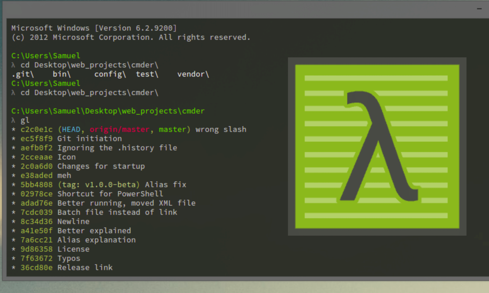

# Guia de Configuração: Git e GitHub para Windows

Este documento detalha a configuração do ambiente de desenvolvimento e introduz os conceitos fundamentais de Git que utilizaremos.

---

### 1. Ferramentas Essenciais: Git e GitHub

#### 1.1. Git: O Sistema de Controle de Versão

**Git** é uma ferramenta de linha de comando que gerencia o histórico de alterações em um projeto. Ele não depende de uma conexão com a internet para funcionar, pois todo o histórico é armazenado localmente no seu computador, em uma pasta oculta chamada `.git`.

Os três conceitos fundamentais que você precisa entender são:

* **Commit**: É um "ponto de salvamento" no histórico do projeto. Cada commit é um registro permanente das alterações feitas em um ou mais arquivos. Ele representa um snapshot do estado do projeto naquele momento.
* **Message (Mensagem do Commit)**: Todo commit exige uma mensagem descritiva. Essa mensagem deve explicar *o que* foi alterado e *por quê*. Mensagens claras são cruciais para a manutenção do código.


* **Branch**: É uma linha de desenvolvimento independente. Pense nela como uma cópia do projeto onde você pode trabalhar em uma nova funcionalidade ou corrigir um bug sem afetar a linha principal (geralmente chamada de `main` ou `master`). Após concluir o trabalho, a branch pode ser mesclada de volta à linha principal.


#### 1.2. GitHub: A Plataforma de Hospedagem

**GitHub** é uma plataforma web que hospeda repositórios Git. Ele centraliza o código, permitindo que a equipe colabore no mesmo projeto de forma assíncrona. O GitHub adiciona uma camada de gerenciamento sobre o Git, com ferramentas para revisão de código (Pull Requests), acompanhamento de tarefas (Issues) e automação (Actions).

**A Diferença:**
* **Git** é a ferramenta local que você usa para fazer commits e gerenciar branches.
* **GitHub** é o servidor remoto onde o repositório fica armazenado, permitindo a colaboração e o backup do histórico.

---

### 2. Configuração do Ambiente (Windows)

O setup a seguir é exclusivo para **Windows**.

> **Usuários Linux/macOS**: Não siga este guia. Entre em contato com um membro efetivado da equipe de software para receber orientação específica para sua distribuição.

#### 2.1. CMDer: O Terminal


O `prompt de comando` padrão do Windows é limitado. Utilizaremos o **CMDer**, um emulador de console que integra o Git Bash e permite o uso de comandos Linux, essenciais para o fluxo de trabalho de desenvolvimento.

* **Instalação**: Para entender o que é o CMDer e como instalá-lo, assista a este vídeo: [CMDer - O melhor terminal para Windows](https://www.youtube.com/watch?v=Ebs9Z61jWl0).
* **Use o CMDer para todos os comandos a seguir.** (**IMPORTANTE:** Não utilize o Cmder em modo admin!)

---

### 3. Instalação do Git

1.  **Download**: Acesse [https://git-scm.com/](https://git-scm.com/) e baixe o instalador para Windows.
2.  **Instalação**: Execute o arquivo baixado. Prossiga pelo assistente de instalação clicando em "Next". As configurações padrão são adequadas e garantem compatibilidade.
3.  **Verificação**: Ao final, abra o CMDer e execute o comando:
    ```bash
    git --version
    ```
    A saída deve ser `git version X.XX.X.windows.X`, confirmando a instalação.

---

### 4. Configuração da Chave SSH para o GitHub

A comunicação entre sua máquina e o GitHub deve ser feita via SSH para segurança e para evitar a digitação de senhas. Isso é feito com um par de chaves criptográficas: uma pública (que você coloca no GitHub) e uma privada (que fica na sua máquina).

#### 4.1. Gerando o Par de Chaves SSH

1.  **Abra o CMDer**.
2.  **Execute o comando de geração**, substituindo pelo seu e-mail do GitHub:
    ```bash
    ssh-keygen -t ed25519 -C "seu_email@exemplo.com"
    ```
3.  **Local do Arquivo**: O terminal perguntará onde salvar a chave. Pressione `Enter` para usar o caminho padrão.
4.  **Passphrase (Senha)**: Será solicitado que você crie uma senha para a chave. **É uma etapa de segurança crítica. Crie uma senha forte.** Você precisará digitá-la para confirmar.

#### 4.2. Adicionando a Chave Pública ao GitHub

1.  **Copie a chave pública**: Use o comando abaixo para copiar o conteúdo do arquivo da chave pública diretamente para sua área de transferência.
    ```bash
    cat ~/.ssh/id_ed25519.pub | clip
    ```
2.  **Acesse o GitHub**: Faça login e navegue até **Settings** (clicando na sua foto de perfil).
3.  **Vá para a seção de chaves**: No menu lateral, clique em **"SSH and GPG keys"**.
4.  **Adicione a chave**: Clique em **"New SSH key"**.
    * **Title**: Dê um nome descritivo para a chave (ex: "Notebook Dell Pessoal").
    * **Key**: Cole (`Ctrl+V`) o conteúdo da sua área de transferência.
5.  **Salve**: Clique em **"Add SSH key"**.

#### 4.3. Segurança da Chave

* O arquivo `id_ed25519` (sem extensão) é sua chave privada. **Nunca o compartilhe.**
* O arquivo `id_ed25519.pub` é sua chave pública, segura para ser compartilhada e usada em serviços como o GitHub.

Seu ambiente está pronto.
